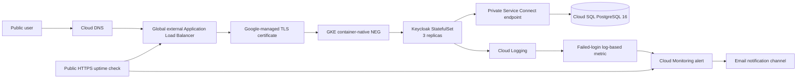

# Keycloak on Google Cloud Platform

## Overview

This practice project deploys Keycloak 26.6.4 as a three-replica workload on Google Kubernetes Engine (GKE). Keycloak stores its persistent data in a Cloud SQL for PostgreSQL 16 instance and reaches the database through Private Service Connect (PSC), without using a public database IP. A GKE-managed external Application Load Balancer exposes Keycloak over HTTPS at `keycloak.lab.getvitrina.gr`, with DNS hosted in Cloud DNS and a certificate managed by Google.

Terraform provisions the GCP infrastructure and monitoring resources. Helm deploys Keycloak using the maintained Codecentric `keycloakx` chart. This repository is a learning environment created in preparation for a platform engineering case study; it is not a production environment.

## Architecture



The main traffic paths are:

- Public traffic: Cloud DNS -> global external load balancer -> Google-managed TLS -> GKE Ingress -> container-native NEG -> Keycloak pods.
- Database traffic: Keycloak pods -> private VPC routing -> PSC endpoint -> Cloud SQL. Cloud SQL has no public IPv4 address.
- Monitoring: GCP uptime check and Keycloak container logs -> Cloud Monitoring alert policies -> email notification channel.

## Repository Structure

```text
.
|-- terraform/
|   |-- environments/dev/       # Practice-environment variable values
|   |-- modules/network/        # VPC, subnets, secondary ranges, Cloud NAT
|   |-- modules/gke/            # GKE cluster, node pools, node service account
|   |-- modules/cloudsql/       # PostgreSQL, database/user, PSC endpoint
|   |-- modules/public-endpoint/# Cloud DNS zone, A record, global static IP
|   `-- modules/monitoring/      # Uptime, log metric, alert policies, email channel
|-- helm/keycloak/
|   |-- values.yaml             # KeycloakX Helm values
|   |-- managed-certificate.yaml
|   |-- frontend-config.yaml    # HTTP-to-HTTPS redirect
|   `-- backend-config.yaml     # Load-balancer health check
|-- scripts/
|   `-- deploy-keycloak.ps1     # Idempotent secret creation and Helm deployment
`-- docs/                       # Detailed design and operational documentation
```

## Prerequisites

- A GCP project with billing enabled and permission to manage networking, GKE, Cloud SQL, DNS, IAM, Logging and Monitoring.
- Google Cloud CLI (`gcloud`).
- Terraform.
- `kubectl` and the GKE authentication plugin.
- Helm 3 with OCI registry support.
- PowerShell 7 for the deployment script.
- A public parent DNS zone from which the Cloud DNS subdomain can be delegated.

Authenticate before running Terraform:

```powershell
gcloud auth login --update-adc
gcloud config set project keycloak-practice-01
```

## Deployment

### 1. Provision GCP infrastructure

Run commands from `terraform/`:

```powershell
terraform init
terraform fmt -check -recursive
terraform validate
terraform plan -var-file="environments/dev/terraform.tfvars" -out="dev.plan"
terraform apply "dev.plan"
```

The saved plan uses the `.plan` suffix deliberately. A `.tfplan` or `.tfvars` suffix can cause `terraform fmt -recursive` to treat the binary plan as Terraform source.

### 2. Delegate the public DNS subdomain

Terraform creates the public Cloud DNS zone for `lab.getvitrina.gr`. Its assigned Google nameservers must be added as `NS` records in the parent `getvitrina.gr` zone. This delegation is currently a manual step because the parent zone is managed outside this Terraform configuration.

Validate delegation and the Keycloak record:

```powershell
Resolve-DnsName -Type NS lab.getvitrina.gr
Resolve-DnsName keycloak.lab.getvitrina.gr
```

### 3. Connect kubectl to GKE

```powershell
gcloud container clusters get-credentials keycloak-gke `
  --region us-central1 `
  --project keycloak-practice-01

kubectl config current-context
```

### 4. Create GKE load-balancer configuration

Apply the GKE-specific resources before installing the Helm release:

```powershell
kubectl create namespace keycloak --dry-run=client -o yaml | kubectl apply -f -
kubectl apply -n keycloak -f helm/keycloak/backend-config.yaml
kubectl apply -n keycloak -f helm/keycloak/frontend-config.yaml
kubectl apply -n keycloak -f helm/keycloak/managed-certificate.yaml
```

The `BackendConfig` sends health checks to Keycloak's management health endpoint. The `FrontendConfig` redirects HTTP to HTTPS. The `ManagedCertificate` asks GKE to provision and renew the public certificate after DNS resolves to the load balancer.

### 5. Deploy Keycloak

Run from the repository root:

```powershell
./scripts/deploy-keycloak.ps1
```

The script verifies the active Kubernetes context, reads the PSC endpoint and generated database password from Terraform outputs, creates or updates the Kubernetes database secret, creates the bootstrap administrator secret only when it does not already exist, and runs `helm upgrade --install` with a pinned chart version.

## Validation

### Kubernetes and Helm

```powershell
helm status keycloak -n keycloak
kubectl get pods,services,ingress -n keycloak
kubectl rollout status statefulset/keycloak-keycloakx -n keycloak --timeout=10m
kubectl get managedcertificate -n keycloak
kubectl describe ingress keycloak-keycloakx -n keycloak
```

Expected results include three ready Keycloak pods, an Ingress with the reserved global IP, healthy NEG backends and an `Active` managed certificate.

### HTTPS and OpenID Connect

```powershell
curl.exe -I http://keycloak.lab.getvitrina.gr
curl.exe -I https://keycloak.lab.getvitrina.gr
curl.exe -f https://keycloak.lab.getvitrina.gr/realms/master/.well-known/openid-configuration
```

HTTP should redirect to HTTPS, HTTPS should present a publicly trusted certificate, and the OpenID Connect discovery endpoint should return a successful response.

### Database privacy

```powershell
gcloud sql instances describe keycloak-postgres `
  --project keycloak-practice-01 `
  --format="yaml(settings.ipConfiguration,pscServiceAttachmentLink)"

terraform -chdir=terraform output cloudsql_psc_endpoint_ip
```

Cloud SQL must not expose a public IPv4 address. Keycloak's configured database hostname must match the private PSC endpoint output.

## OAuth Test

The public Keycloak test application at `https://www.keycloak.org/app/` was validated using:

```text
Keycloak URL: https://keycloak.lab.getvitrina.gr
Realm: demo
Client ID: keycloak-app
```

The realm, public OpenID Connect client and test user are currently configured manually in the Keycloak Admin Console. The client uses the Authorization Code flow, allows redirects only to `https://www.keycloak.org/app/*`, and does not use a client secret because it is a browser-based public client.

Test credentials must never be committed to this repository. They should be provided through a separate secure channel when required.

## Monitoring

Terraform provisions:

- A public HTTPS uptime check against `/realms/master/.well-known/openid-configuration` every 60 seconds with TLS validation enabled.
- An email notification channel.
- An uptime alert policy.
- A counter-type logs-based metric matching Keycloak `LOGIN_ERROR` events with `invalid_user_credentials` or `user_not_found`.
- An alert that sums failures across all Keycloak pods and fires when the total is greater than 10 in a 60-second alignment period.

The uptime alert was tested by scaling the Keycloak StatefulSet to zero and then restoring it to three replicas:

```powershell
kubectl scale statefulset/keycloak-keycloakx -n keycloak --replicas=0
kubectl scale statefulset/keycloak-keycloakx -n keycloak --replicas=3
kubectl rollout status statefulset/keycloak-keycloakx -n keycloak --timeout=10m
```

The failed-login alert can be tested by submitting 11 invalid passwords within one 60-second metric interval. The logging metric counts only events created after the metric was provisioned.

## CI/CD Example

The GitHub Actions workflow at `.github/workflows/ci.yml` runs on pull requests, pushes to `main` and manual dispatch. It checks Terraform formatting and validation, renders the pinned KeycloakX Helm chart, parses the Kubernetes YAML and validates the PowerShell deployment script.

The workflow deliberately performs no infrastructure changes and requires no cloud credentials. In a production pipeline, a separate protected deployment job would authenticate with short-lived Workload Identity Federation credentials, consume remote Terraform state, publish a reviewed plan artifact and require environment approval before `terraform apply` or Helm deployment. The repository's `scripts/deploy-keycloak.ps1` demonstrates the idempotent application deployment command sequence.

## Security and Networking

- GKE nodes use private IP addresses; outbound access is provided by Cloud NAT.
- The Kubernetes control plane is reachable only from configured authorized networks.
- Cloud SQL has no public IPv4 address and accepts PSC consumers only from the allowed project.
- The public load balancer terminates TLS with a Google-managed certificate.
- The GKE-created firewall rule limits load-balancer and health-check traffic to Google's documented source ranges and required backend ports.
- The Keycloak Service is `ClusterIP`; the Ingress reaches pods through a container-native NEG rather than a public `LoadBalancer` Service.
- Database and administrator credentials are stored in Kubernetes Secrets and are not committed to Git.
- The current bootstrap administrator is suitable for initial setup only. A permanent administrator and an auditable secret-management workflow are required for a production environment.

## Reliability

- Keycloak runs three replicas and uses a PodDisruptionBudget with `minAvailable: 2`.
- Cloud SQL uses regional high availability, automated backups and point-in-time recovery configuration.
- GKE node pools use autoscaling.
- Readiness health checks prevent unhealthy Keycloak pods from receiving load-balancer traffic.
- Helm pins the chart and Keycloak image versions, enabling repeatable upgrades and rollbacks.

Three replicas improve application availability but do not make every dependency highly available. The external load balancer, DNS, GKE control plane, node capacity, PSC connectivity and Cloud SQL remain part of the end-to-end reliability design.

## Cost Considerations

The environment uses `e2-medium` GKE nodes with autoscaling and a 20 GB Cloud SQL disk. The primary cost drivers are the regional Cloud SQL instance, continuously running GKE nodes, the global external load balancer and Cloud NAT.

Regional Cloud SQL and three Keycloak replicas were selected to demonstrate the case-study high-availability requirements, not to minimize the absolute cost of a temporary sandbox. A cheaper non-HA practice environment could use zonal Cloud SQL, smaller database sizing, fewer replicas and scheduled teardown, but those settings would not demonstrate the requested architecture.

## Known Limitations

- Terraform state is local. A shared environment should use a versioned, access-controlled GCS backend with state locking.
- `terraform.tfvars` is intentionally ignored, but the repository does not yet contain a sanitized `terraform.tfvars.example`.
- The Keycloak realm, OAuth client and test user are configured manually and are not yet managed as code.
- Kubernetes Secrets are populated from local Terraform output by the deployment script; production should use Secret Manager with Workload Identity and a controlled secret-delivery mechanism.
- The bootstrap administrator has not yet been replaced with a permanent administrative account.
- Parent-zone DNS delegation is manual because the parent zone is outside this Terraform configuration.
- A real Cloud SQL restore drill has not yet been performed; the documented recovery procedure must be tested before production use.

## Further Documentation

- `docs/architecture.md`: detailed component and networking decisions.
- `docs/resource-inventory.md`: project hierarchy, resource names, service tiers, IAM roles, clusters and buckets.
- `docs/operations.md`: backup, restore, upgrade, rollback and maintenance runbooks.
- `docs/troubleshooting.md`: diagnostic commands and common failure modes.
- `docs/case-study-summary.md`: completed work, incomplete work and final handoff notes.
