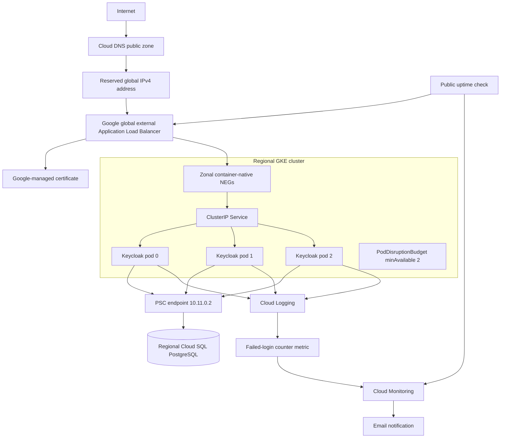

# Architecture

## Scope

This document describes the practice deployment of Keycloak on Google Cloud Platform. The design demonstrates the requested case-study capabilities while keeping application deployment separate from infrastructure provisioning:

- Terraform owns GCP infrastructure and monitoring.
- Helm owns the Keycloak release.
- Small GKE-specific manifests own load-balancer integrations that are not part of the Helm chart.
- Manual configuration is limited to parent DNS delegation and the OAuth demonstration realm, client and user.

## Component View

## Networking

The deployment uses a custom-mode VPC rather than the default network. The main subnet is `10.10.0.0/20`. Alias IP secondary ranges allocate `10.20.0.0/16` to pods and `10.30.0.0/20` to Services. A separate `10.11.0.0/28` subnet holds PSC endpoints.

GKE nodes have private addresses. Cloud NAT provides controlled outbound connectivity for image pulls and external dependencies without assigning public addresses to nodes. The GKE control-plane endpoint remains public, but master authorized networks restrict access to explicitly configured administrator CIDRs.

Cloud SQL has `ipv4_enabled = false`. Terraform reserves an internal address with purpose `GCE_ENDPOINT` and creates a regional forwarding rule targeting the Cloud SQL PSC service attachment. Keycloak uses this private endpoint as its PostgreSQL hostname. The allowed PSC consumer list is restricted to the practice project.

This design keeps database traffic on private Google networking and avoids a Cloud SQL public address. PSC is different from a public load-balancer address: the PSC endpoint is regional, internal and used only by VPC clients.

## GKE Design

The regional GKE cluster uses VPC-native networking, private nodes, Workload Identity, the Regular release channel, managed Prometheus, workload logging and system monitoring.

Two autoscaled node pools separate system and workload capacity. Nodes use a dedicated service account with the minimum roles currently needed for Artifact Registry reads, log writes and monitoring. Auto-repair and auto-upgrade are enabled. Surge upgrades use one additional node and allow zero unavailable nodes during node-pool upgrades.

Keycloak runs as a three-replica StatefulSet through the KeycloakX Helm chart. A PodDisruptionBudget requires at least two available replicas during voluntary disruption. CPU and memory requests provide scheduler guarantees; limits bound per-pod consumption.

The three replicas share no local application database state. Durable identity data lives in Cloud SQL. Keycloak cluster discovery and cache behavior are supplied by the chart and Keycloak configuration, while the headless Service provides stable StatefulSet networking.

## Public Endpoint and TLS

Terraform reserves the global address `keycloak-public-ip`, creates the public Cloud DNS zone and publishes an A record for `keycloak.lab.getvitrina.gr`. Delegation from the externally managed parent zone is manual.

The Helm chart creates a GKE Ingress. Its Service remains `ClusterIP` and carries a NEG annotation, so the load balancer targets pod endpoints directly rather than traversing a NodePort data path.

Three GKE integration resources complete the endpoint:

- `ManagedCertificate` provisions and renews a publicly trusted certificate after DNS points to the load balancer.
- `FrontendConfig` returns a permanent HTTP-to-HTTPS redirect.
- `BackendConfig` probes `/health/ready` on Keycloak's management port `9000`.

TLS terminates at the Google load balancer. Keycloak receives proxied HTTP and trusts forwarded headers through `proxy.mode: xforwarded`. Strict hostname configuration prevents Keycloak from constructing URLs from untrusted Host headers.

## Database and Data Protection

Cloud SQL runs PostgreSQL 16 using the Enterprise edition, regional availability and SSD storage with automatic disk growth. Terraform creates the `keycloak` database, a dedicated database user and a randomly generated 32-character password.

Automated backups run daily at `03:00` UTC. Seven backups are retained. Point-in-time recovery is enabled with seven days of transaction logs. The stable maintenance track and a Sunday `03:00` UTC maintenance window make maintenance timing predictable.

Regional availability protects against a zonal infrastructure failure, but it is not a substitute for tested backups. Recovery procedures are documented in `operations.md`.

## Secrets

Terraform generates the database password and stores it in Terraform state as sensitive data. The deployment script reads the sensitive output and creates the `keycloak-db-credentials` Kubernetes Secret. It creates a random bootstrap administrator password only if `keycloak-admin-credentials` does not already exist.

This is acceptable for a time-limited practice environment but not the preferred production flow. A production design should store secrets in Secret Manager, use Workload Identity for access, restrict secret readers and define rotation without exposing plaintext through local process output.

## Monitoring

The public uptime check requests the master realm OpenID Connect discovery document over port 443 every 60 seconds and validates TLS. Its alert condition evaluates the boolean `check_passed` metric and notifies the configured email channel on sustained failure.

Keycloak emits `LOGIN_ERROR` events to stdout. GKE workload logging sends them to Cloud Logging. A user-defined DELTA/INT64 log metric counts events containing `LOGIN_ERROR` and either `invalid_user_credentials` or `user_not_found`. It deliberately excludes configuration errors such as `client_not_found`. The alert aligns counts into 60-second windows, sums each pod's events and then reduces across all pods. `COMPARISON_GT` with threshold `10` therefore fires from the eleventh failed credential attempt in an aligned interval.

No username, IP address or realm is extracted into metric labels. This limits metric cardinality, cost and unnecessary replication of identity data.

## Key Decisions and Trade-offs

| Decision | Benefit | Trade-off |
|---|---|---|
| Terraform modules by GCP concern | Clear ownership and reusable interfaces | More files than a single-root PoC |
| Maintained Helm chart | Avoids hand-written Keycloak workload manifests | Requires understanding chart-specific values |
| Three Keycloak replicas | Meets the HA application requirement | Higher GKE cost |
| Regional Cloud SQL | Zonal database failover | Major cost driver for a PoC |
| PSC with no public DB IP | Private database path and smaller attack surface | Additional subnet, forwarding rule and troubleshooting surface |
| GKE Ingress and managed certificate | Managed global load balancing and certificate renewal | GKE-specific resources and provisioning delay |
| Local Terraform state for practice | Fast initial setup | Not suitable for team collaboration or CI |
| Manual demo realm/client | Fast OAuth validation | Configuration drift; should become code if maintained |

## Production Improvements

Before treating this design as production-ready:

1. Move Terraform state to a versioned, access-controlled GCS backend.
2. Replace bootstrap administration with named permanent administrators and MFA.
3. Integrate Secret Manager using Workload Identity and implement rotation.
4. Manage realms, clients and roles as code or through a controlled export/import process.
5. Add NetworkPolicies, policy enforcement and explicit workload identity bindings.
6. Define SLOs, latency/error dashboards and database capacity alerts.
7. Test restore, failover and upgrade runbooks regularly.
8. Add CI policy checks, security scanning and protected approvals.
